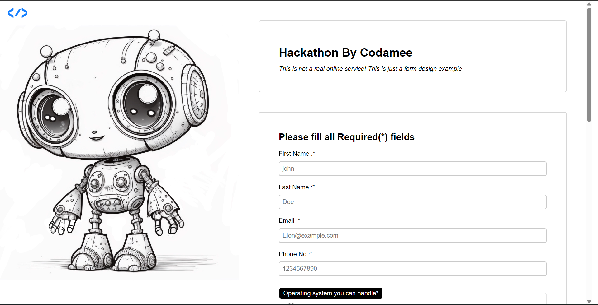

# Sign-up Form

A  landing page for a fictional Hackathon event. This project focuses on **Intermediate CSS Layouts**, custom-styled form elements, and native browser validation logic.

  

## 🚀 Live Demo
[Try the Live Form Here](https://codamee.github.io/sign-up-form/)

## 🎨 Key Features
* **Modern Custom Select:** Implemented the cutting-edge `::picker(select)` and `popover` API for a fully custom, animated dropdown experience.
* **Smart Validation:** Real-time feedback using `:user-valid` and `:user-invalid` pseudo-classes to highlight form errors instantly.
* **Custom Form Controls:** Rebuilt standard checkboxes and radio buttons from scratch using `appearance: none` and CSS transitions for a unique brand identity.
* **Split-Screen UI:** A balanced layout featuring a fixed hero sidebar with a background overlay and a scrollable form container.

## 🛠️ Technical Skills
* **Advanced CSS Transitions:** Leveraged `@starting-style` and opacity transitions to create smooth UI reveals for the custom picker.
* **Form UX:** Strategic use of `:focus` states and custom outlines to improve user guidance and accessibility.
* **Semantic HTML:** Proper use of `<fieldset>`, `<legend>`, and `<section>` to ensure input data is grouped logically and semantically.
* **Responsive Units:** Utilized `vw` and `vh` units to ensure the two-column layout fills the viewport perfectly.

---
*Built as part of The Odin Project Intermediate HTML and CSS.*
